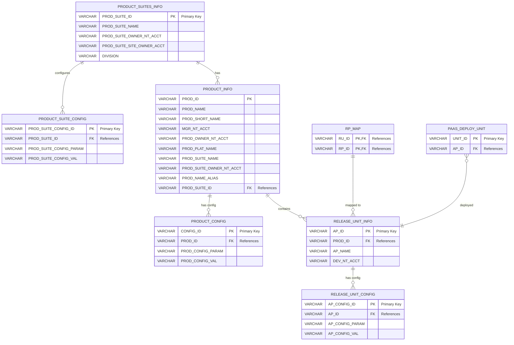

```mermaid
erDiagram
    PRODUCT_SUITES_INFO {
        VARCHAR PROD_SUITE_ID PK "Primary Key"
        VARCHAR PROD_SUITE_NAME ""
        VARCHAR PROD_SUITE_OWNER_NT_ACCT ""
        VARCHAR PROD_SUITE_SITE_OWNER_ACCT ""        
        VARCHAR DIVISION ""
    }

    PRODUCT_SUITE_CONFIG {
        VARCHAR PROD_SUITE_CONFIG_ID PK "Primary Key"
        VARCHAR PROD_SUITE_ID FK "References"
        VARCHAR PROD_SUITE_CONFIG_PARAM ""
        VARCHAR PROD_SUITE_CONFIG_VAL "" 
    }

    PRODUCT_INFO {
        VARCHAR PROD_ID PK ""
        VARCHAR PROD_NAME ""
        VARCHAR PROD_SHORT_NAME ""
        VARCHAR MGR_NT_ACCT ""
        VARCHAR PROD_OWNER_NT_ACCT ""
        VARCHAR PROD_PLAT_NAME ""
        VARCHAR PROD_SUITE_NAME ""
        VARCHAR PROD_SUITE_OWNER_NT_ACCT ""
        VARCHAR PROD_NAME_ALIAS ""
        VARCHAR PROD_SUITE_ID FK "References"
    }

    PRODUCT_CONFIG {
        VARCHAR CONFIG_ID PK "Primary Key"
        VARCHAR PROD_ID FK "References"
        VARCHAR PROD_CONFIG_PARAM ""
        VARCHAR PROD_CONFIG_VAL ""
    }

    RELEASE_UNIT_INFO {
        VARCHAR AP_ID PK "Primary Key"
        VARCHAR PROD_ID FK "References"
        VARCHAR AP_NAME ""
        VARCHAR DEV_NT_ACCT ""
    }

    RELEASE_UNIT_CONFIG {
        VARCHAR AP_CONFIG_ID PK "Primary Key"
        VARCHAR AP_ID FK "References"
        VARCHAR AP_CONFIG_PARAM ""
        VARCHAR AP_CONFIG_VAL ""
    }

    PRODUCT_SUITES_INFO ||--o{ PRODUCT_SUITE_CONFIG : "configures"
    PRODUCT_SUITES_INFO ||--o{ PRODUCT_INFO : "has"
    PRODUCT_INFO ||--o{ PRODUCT_CONFIG : "has config"
    PRODUCT_INFO ||--o{ RELEASE_UNIT_INFO : "contains"
    RELEASE_UNIT_INFO ||--o{ RELEASE_UNIT_CONFIG : "has config"
    RP_MAP ||--o{ RELEASE_UNIT_INFO : "mapped to"
    PAAS_DEPLOY_UNIT }o--|| RELEASE_UNIT_INFO : "deployed"

    RP_MAP {
        VARCHAR RU_ID PK,FK "References"
        VARCHAR RP_ID PK,FK "References"
    }

    PAAS_DEPLOY_UNIT {
        VARCHAR UNIT_ID PK "Primary Key"
        VARCHAR AP_ID FK "References"
    }
```