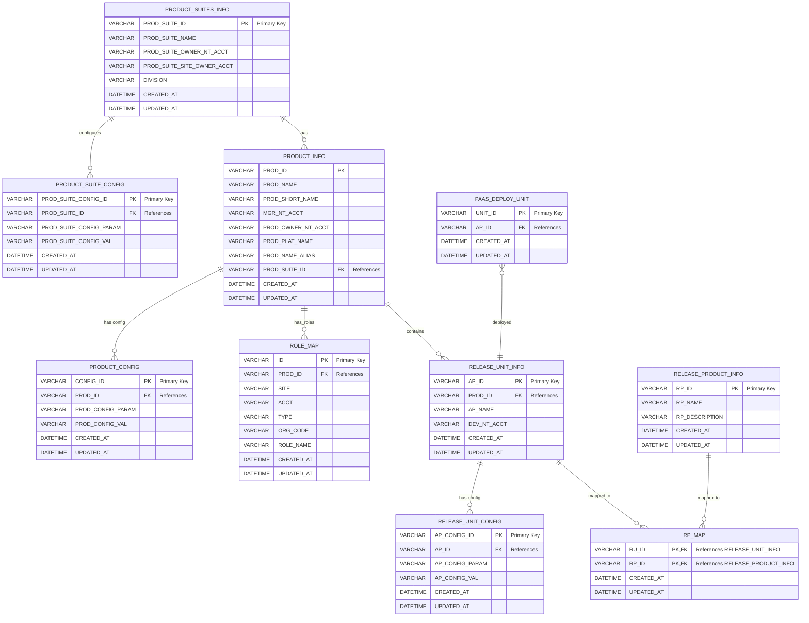

```mermaid
erDiagram
    %% Product Suite
    PRODUCT_SUITES_INFO {
        VARCHAR PROD_SUITE_ID PK "Primary Key"
        VARCHAR PROD_SUITE_NAME ""
        VARCHAR PROD_SUITE_OWNER_NT_ACCT ""
        VARCHAR PROD_SUITE_SITE_OWNER_ACCT ""
        VARCHAR DIVISION ""
        DATETIME CREATED_AT ""
        DATETIME UPDATED_AT ""
    }

    PRODUCT_SUITE_CONFIG {
        VARCHAR PROD_SUITE_CONFIG_ID PK "Primary Key"
        VARCHAR PROD_SUITE_ID FK "References"
        VARCHAR PROD_SUITE_CONFIG_PARAM ""
        VARCHAR PROD_SUITE_CONFIG_VAL ""
        DATETIME CREATED_AT ""
        DATETIME UPDATED_AT ""
    }

    %% Product
    PRODUCT_INFO {
        VARCHAR PROD_ID PK ""
        VARCHAR PROD_NAME ""
        VARCHAR PROD_SHORT_NAME ""
        VARCHAR MGR_NT_ACCT ""
        VARCHAR PROD_OWNER_NT_ACCT ""
        VARCHAR PROD_PLAT_NAME ""
        VARCHAR PROD_NAME_ALIAS ""
        VARCHAR PROD_SUITE_ID FK "References"
        DATETIME CREATED_AT ""
        DATETIME UPDATED_AT ""
    }

    PRODUCT_CONFIG {
        VARCHAR CONFIG_ID PK "Primary Key"
        VARCHAR PROD_ID FK "References"
        VARCHAR PROD_CONFIG_PARAM ""
        VARCHAR PROD_CONFIG_VAL ""
        DATETIME CREATED_AT ""
        DATETIME UPDATED_AT ""
    }

    ROLE_MAP {
        VARCHAR ID PK "Primary Key"
        VARCHAR PROD_ID FK "References"
        VARCHAR SITE ""
        VARCHAR ACCT ""
        VARCHAR TYPE ""
        VARCHAR ORG_CODE ""
        VARCHAR ROLE_NAME ""
        DATETIME CREATED_AT ""
        DATETIME UPDATED_AT ""
    }

    %% Release Unit
    RELEASE_UNIT_INFO {
        VARCHAR AP_ID PK "Primary Key"
        VARCHAR PROD_ID FK "References"
        VARCHAR AP_NAME ""
        VARCHAR DEV_NT_ACCT ""
        DATETIME CREATED_AT ""
        DATETIME UPDATED_AT ""
    }

    RELEASE_UNIT_CONFIG {
        VARCHAR AP_CONFIG_ID PK "Primary Key"
        VARCHAR AP_ID FK "References"
        VARCHAR AP_CONFIG_PARAM ""
        VARCHAR AP_CONFIG_VAL ""
        DATETIME CREATED_AT ""
        DATETIME UPDATED_AT ""
    }

    %% Release Product
    RELEASE_PRODUCT_INFO {
        VARCHAR RP_ID PK "Primary Key"
        VARCHAR RP_NAME ""
        VARCHAR RP_DESCRIPTION ""
        DATETIME CREATED_AT ""
        DATETIME UPDATED_AT ""
    }

    %% Deployment & Mapping
    RP_MAP {
        VARCHAR RU_ID PK,FK "References RELEASE_UNIT_INFO"
        VARCHAR RP_ID PK,FK "References RELEASE_PRODUCT_INFO"
        DATETIME CREATED_AT ""
        DATETIME UPDATED_AT ""
    }

    PAAS_DEPLOY_UNIT {
        VARCHAR UNIT_ID PK "Primary Key"
        VARCHAR AP_ID FK "References"
        DATETIME CREATED_AT ""
        DATETIME UPDATED_AT ""
    }

    %% Relationships
    PRODUCT_SUITES_INFO ||--o{ PRODUCT_SUITE_CONFIG : "configures"
    PRODUCT_SUITES_INFO ||--o{ PRODUCT_INFO : "has"
    PRODUCT_INFO ||--o{ PRODUCT_CONFIG : "has config"
    PRODUCT_INFO ||--o{ ROLE_MAP : "has_roles"
    PRODUCT_INFO ||--o{ RELEASE_UNIT_INFO : "contains"
    RELEASE_UNIT_INFO ||--o{ RELEASE_UNIT_CONFIG : "has config"
    RELEASE_UNIT_INFO ||--o{ RP_MAP : "mapped to"
    RELEASE_PRODUCT_INFO ||--o{ RP_MAP : "mapped to"
    PAAS_DEPLOY_UNIT }o--|| RELEASE_UNIT_INFO : "deployed"
```
